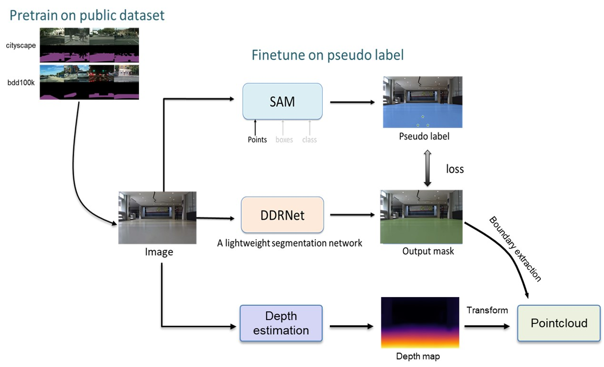
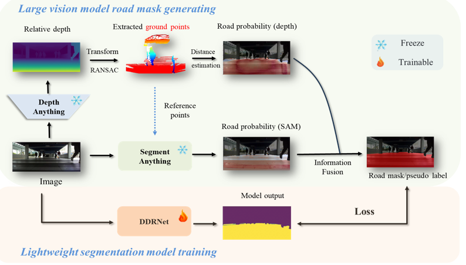
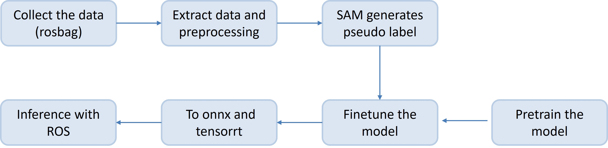

# <div align="center">Labor-saving Semantic Segmentation</div>

<div align="center">
<p>This repo aims to use SAM to help label the road mask to save time and labor for drivable region semantic segmentation</p>
</div>


<div align="center">
    
</div>

<div align="center">
    
</div>


## <div align="center">Introduction</div>
This repo aims to use SAM to generate pseudo labels from the given reference points to supervise the training of the segmentation network for road segmentation.
Then, the segmentation result can combine with the depth estimation result (e.g. result from zed camera/ depth estimation network) to obtain the 3D/2D pointcloud to have a better understanding of the layout of the road

In addition, the trained network can be accelerated by tensorrt to enable real-time inference.

NOTE: This repo is based on [segment anything model](https://arxiv.org/abs/2304.02643) and [DDRNet](https://arxiv.org/abs/2101.06085), the corresponding repo: [SAM Repo](https://github.com/facebookresearch/segment-anything),
[DDRNet Repo](https://github.com/sithu31296/semantic-segmentation). DDRNet Repo contains multiple segmentation networks, users can select the most suitable one from the model zoo are use own model.
In addition, can ref this two repo to find the suitable environment.

Recent updata: the method is updataed to unsupervised with the assistance of [depth anything model](https://github.com/DepthAnything/Depth-Anything-V2)
## <div align="center">Workflow</div>

<div align="center">
    
</div>

1. **Collect the data** (e.g., in .bag format using ROS)
2. **Extract and process the data**
3. **Use SAM to generate the pseudo labels**
4. **Finetune/train the model** (can pretrain on some public dataset for initialization)
5. **Export the model to ONNX and TensorRT for real-time inference**
6. **Inference with ROS**


## <div align="center">Usage</div>

### Step 1: Extract and process the data

An example can be found in `delta/Extract_image.ipynb`.

### Step 2: Use SAM to generate the pseudo labels

A tutorial can be found in `delta/make_label_withSAM.ipynb`.

### Step 3: Finetune/train the model

Can ref from README_DDRNET.md for detailed infomation
```sh
# Need to modify the .yaml file first
$ python train.py --cfg configs/ntu.yaml
```
### Step 4: Export the model to onnx and tensorrt
```sh
### Export to onnx
$ python export.py --cfg configs/ntu.yaml

### Export to tensorrt, Need to install tensorrt first
$ ./trtexec --onnx='save_path/ddrnet.onnx' --saveEngine='save_path/ddrnet.engine' --fp16
```
### Step 5: ROS inference
```sh
### use .pth for inference
$ python delta/ros_infer.py  
### use .onnx for inference
$ python delta/onnx_infer.py  
### use .engine for inference with depth and publish 2D pointcloud
$ python delta/tensorrt_infer_lasescan.py  
### use .engine for inference with depth and publish 3D pointcloud
$ python delta/tensorrt_infer_with_depth_refine_more.py 
```
NOTE: 

tensorrt_infer_lasescan.py and tensorrt_infer_with_depth_refine_more.py are also able to generate segmentation result only without depth input 

Goes to depthanythingv2 repo to download the weights for depthanything model: https://github.com/DepthAnything/Depth-Anything-V2

And Download segmenganything weights from: https://github.com/facebookresearch/segment-anything

